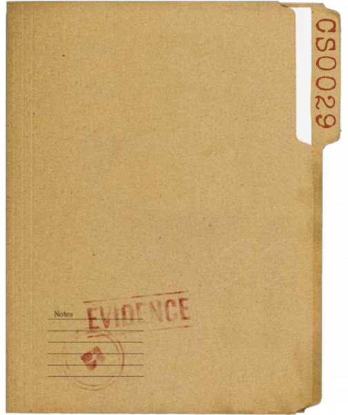

<div align="center">


<h1 style="font-size:42px;">ENIGMA 29</h1>
Unlock Mysteries, Empower Minds, Conquer Challenges  

<br/>


<br/>

Built with the tools and technologies:  


</div>


<div align="center">
  
</div>

## 📋 Overview

Enigma 29 is an interactive puzzle-solving detective game designed for educational environments. Players work together in teams to solve information security puzzles, competing against other teams in their section. The game features real-time collaboration, synchronized gameplay, and a leaderboard system.

<div align="center">
  
</div>

## ✨ Features

- 🧩 Dynamic puzzle cards with varying difficulty levels (Easy, Medium, Hard)
- 👥 Team-based gameplay with real-time synchronization for up to 8 members
- 🔄 Synchronized timer across team members with auto-sync for late joiners
- 📊 Section-based leaderboards showing highest team scores
- 🎯 Point system based on puzzle difficulty and hint usage
- 💡 Hint system for challenging puzzles (with point penalties)
- 🛠️ Admin dashboard for managing questions, sections, and sessions
- 🔒 Secure access code system for section management

## 🛠️ Technologies

- **Frontend**: React 18 with Vite, Framer Motion for animations, Styled Components for styling
- **Backend**: Supabase (PostgreSQL) for database and authentication
- **Authentication**: Custom access code system with team-based authentication
- **State Management**: React Hooks & Context API
- **Deployment**: Ready for Vercel deployment

## 🚀 Getting Started

### Prerequisites

- Node.js (v16+)
- NPM or Yarn
- Supabase account

### Installation

1. Clone the repository
```bash
git clone https://github.com/your-username/enigma.git
cd enigma
```

2. Install dependencies
```bash
npm install
# or
yarn install
```

3. Create a `.env` file in the root directory with your Supabase credentials:
```
VITE_SUPABASE_URL=your_supabase_url
VITE_SUPABASE_ANON_KEY=your_supabase_anon_key
```

4. Initialize the database
```bash
node src/scripts/setup.js
```

5. Start the development server
```bash
npm run dev
# or
yarn dev
```

6. Access the application at `http://localhost:5173`

## 📝 Game Mechanics

### Access Code System
- Each section has unique access codes managed by administrators
- Team members use the same access code to join the game
- Questions are randomized based on the access code for consistency
- Access codes control which section the team belongs to

### Team Collaboration
- Up to 8 members can join a team
- Teams have a unique name for identification
- All members see the same set of puzzles in the same order
- Solved puzzles sync across all team members in real-time
- The 30-minute timer is synchronized for all team members
- First member to log in starts the timer for the whole team
- Late joiners automatically sync with the current game state

### Scoring System
- Easy questions: 50 points
- Medium questions: 100 points
- Hard questions: 200 points
- Points deducted for using hints (-5 points per hint)
- Team scores are based on correctly solved puzzles

## 👥 Team Features

1. **Team Creation**:
   - Enter an access code for the section
   - Enter a unique team name
   - Add team member names (minimum 1, maximum 8)
   - View section information before confirming

2. **Real-time Synchronization**:
   - Game progress is synchronized for all team members
   - The first member to log in starts the timer
   - Other members joining later will see the current timer state
   - Solved puzzles are visible to all team members
   - Points are automatically updated for all team members

3. **Team Leaderboard**:
   - Shows the highest score from each team within a section
   - Highlights your team in the rankings
   - Automatically updates when the game ends
   - Shows detailed team statistics

## 🔧 Admin Features

Access the admin dashboard at `/admin` to:

1. **Question Management**:
   - Create, update, and delete questions
   - Set difficulty levels (Easy, Medium, Hard)
   - Add up to three hints per question
   - Set correct answers and point values

2. **Section Management**:
   - Create and manage sections (e.g., classes, groups)
   - Generate and manage access codes
   - View section statistics

3. **Session Management**:
   - Monitor active game sessions
   - View team progress in real-time
   - End sessions manually if needed
   - Export results for analysis

## 📂 Project Structure

```
enigma/
├── public/              # Static assets
├── src/
│   ├── assets/          # Images, fonts, etc.
│   ├── components/      # React components
│   │   ├── admin/       # Admin dashboard components
│   │   ├── common/      # Shared components
│   │   └── game/        # Game-specific components
│   ├── pages/           # Page components
│   │   ├── AdminDashboard.jsx
│   │   ├── AdminLogin.jsx
│   │   ├── AuthPage.jsx
│   │   ├── GameBoard.jsx
│   │   ├── LandingPage.jsx
│   │   └── NotFound.jsx
│   ├── services/        # API services
│   ├── styles/          # Global styles
│   ├── utils/           # Utility functions
│   │   ├── authUtils.js # Authentication utilities
│   │   ├── dbUtils.js   # Database utilities
│   │   └── gameUtils.js # Game mechanics utilities
│   └── scripts/         # Setup and database scripts
├── .env                 # Environment variables
└── README.md            # This file
```

## 🔍 Game Scenarios

### New Team Setup
1. Team enters access code, team name, and member names on the Auth page
2. Game generates consistent puzzle order based on access code
3. 30-minute timer starts for the first member
4. Other members join with the same access code and see the same puzzles and timer

### Collaborative Puzzle Solving
1. Any team member can click on puzzle cards to open a question
2. Team members can submit answers independently
3. When a puzzle is solved by one member, it's marked as solved for all members
4. Points are added to the team's score
5. Progress is synchronized across all team members
6. Game ends when the timer reaches zero or when all puzzles are solved

## 🧪 Development

### Local Development

```bash
npm run dev
# or
yarn dev
```

### Building for Production

```bash
npm run build
# or
yarn build
```

### Database Setup

For detailed database setup instructions, see:
- `src/scripts/DATABASE_SETUP.md`
- `src/scripts/create-tables.sql`

## 📚 Database Schema

The project uses Supabase with the following tables:

1. **students**: Stores team information
   - id, name (team name), section, access_code, points, start_time, end_time, completed_puzzles, group_members, question_seed

2. **questions**: Stores puzzle questions
   - id, question, answer, hints, difficulty, is_active, created_at

3. **access_codes**: Stores valid access codes
   - code, section, is_active, created_at

4. **admin_users**: Stores admin credentials
   - username, password_hash, is_active, created_at

See `src/scripts/create-tables.sql` for the complete schema.

## 🔄 Synchronization Mechanism

The app uses a polling mechanism to keep team members synchronized:
- Timer state is synchronized across all team members
- Completed puzzles are shared among team members
- Points are calculated server-side to maintain consistency
- Game end status is synchronized across all team members

## 📱 Responsive Design

The game is designed to work on multiple screen sizes:
- Desktop: Full experience with optimal layout
- Tablet: Adapted layout with scrollable content
- Mobile: Mobile-friendly view with touch interactions

## 📜 License

This project is licensed under the MIT License.

## 🙏 Credits

- Developed for educational environments to teach information security concepts
- Uses a detective/puzzle theme to engage students
- Special thanks to the contributors and testers 